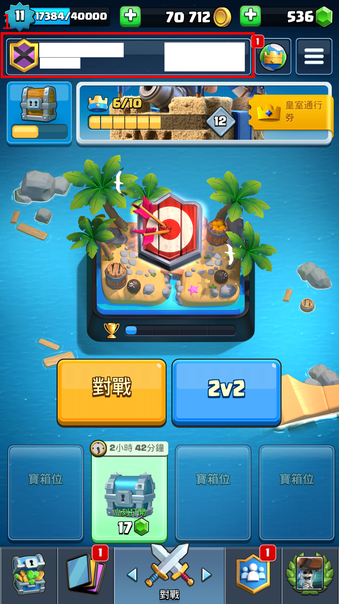
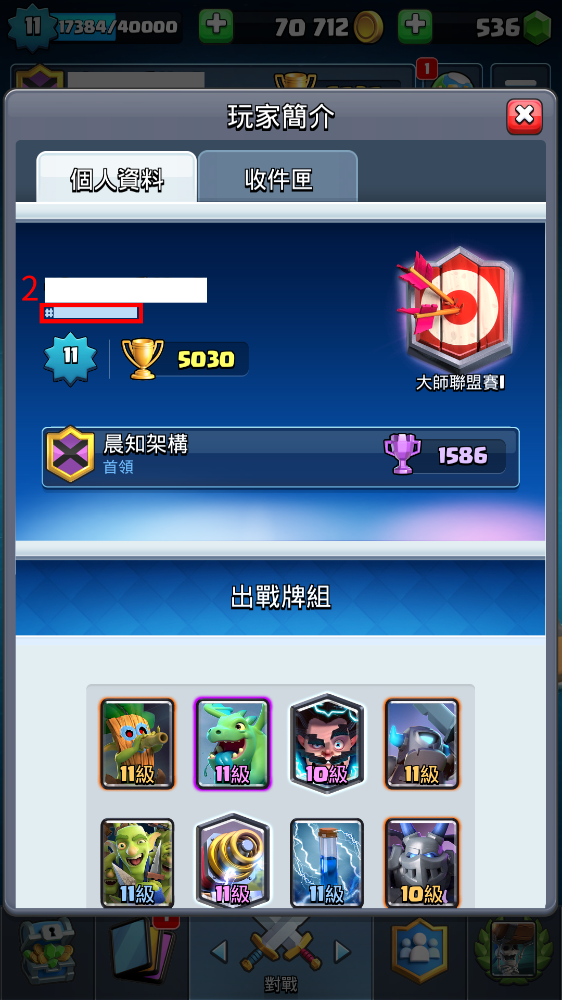
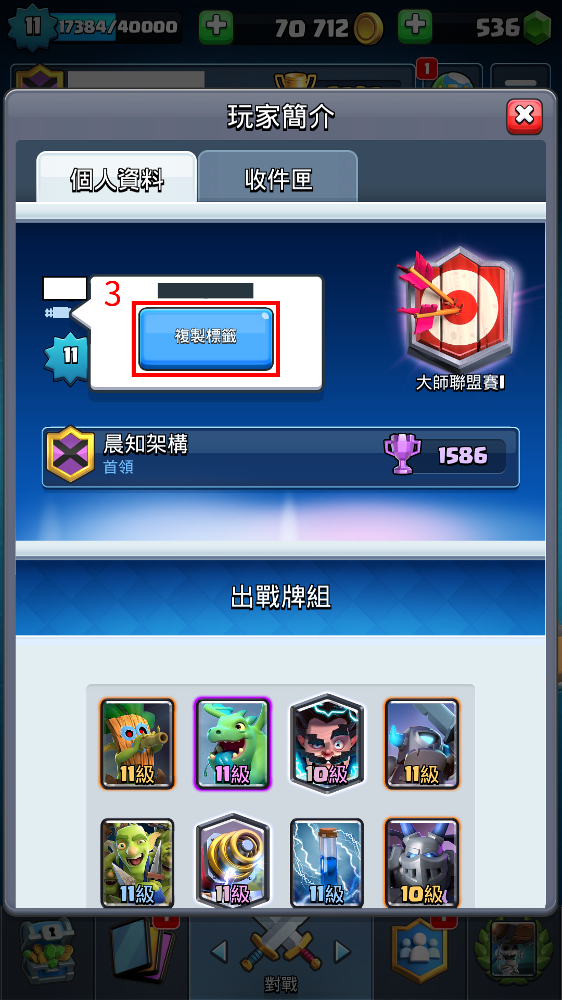

晨知架構
===
## 部落聯絡簡介:
歡迎來到晨知架構，只要是社團底下記名的部落，成員都可以提出入社申請，我們擁有三個部落，歡迎加入。
進來前必須填社團問題，以告知你是部落的誰，帳號名字、帳號標籤、所在部落，若有其中一個不一致則拒絕加入社團請求。

### 部落衝突:皇室戰爭
名稱:[晨知架構](https://link.clashroyale.com/invite/clan/cnt?tag=PQY88GL2&token=w89aw3sk&platform=android)  
標籤:#PQY88GL2  

名稱:[晨知架構](https://link.clashroyale.com/invite/clan/cnt?tag=YG902LVY&token=34r2ayb3&platform=android)  
標籤:#YG902LVY  

名稱:[哈囉你好嗎~](https://link.clashroyale.com/invite/friend/cnt?tag=PRRPVCLGR&token=mzwebxdn&platform=android)  
標籤:#YJJ092R9  

### 荒野亂鬥
名稱:[晨知架構](https://link.brawlstars.com/invite/band/cnt?tag=9UQVLLUL&token=hgys9j9d)

### 微信
晨知架構:已被封帳，機掰微信。

### QQ
建置中，手機無法創建帳號，機掰QQ。

### YouTube
晨知架構 部落衝突:皇室戰爭:https://www.youtube.com/channel/UC-6AxCy_hAtPy6Ieo5VBRlA

### Messenger
[部落衝突:皇室戰爭](https://m.me/join/AbZeHvSvbokSKl7C)  
[部落衝突:皇室戰爭 首領副首領](https://m.me/join/AbbkezE-6l4Kv3nX)  
[傳說對決](https://m.me/join/AbYum3OpehtrhIR4)

## 部落規章
以下敘述中「部落衝突:皇室戰爭」也會用「皇室戰爭」來代表。

### 部落衝突:皇室戰爭標籤系統
創辦一個皇室戰爭的帳號、部落或聯賽時標籤系統會創建一個標籤，會以`#`開頭後面包含一串亂碼如`#YJJ092R9`，每一個標籤代表了部落衝突:皇室戰爭中唯一的帳號、部落或聯賽，因此在這個社團中會很注重部落、成員與聯賽的標籤，成員可以如下圖方式尋找標籤並複製。  

  
先點擊玩家簡介

  
再點擊標籤

  
點擊後會出現複製標籤

1. 如果
2. 社團記名的部落會在部落規章中紀錄所有的部落標籤來確保成員加入正確的部落。
2. 成員會有一個貼文專門紀錄每一個Facebook帳號對應的部落衝突:皇室戰爭標籤。
3. 而在社團發布的聯賽活動也必須有標籤做發佈，因此在社團的討論區與聊天室的正式發文必須提到標籤作為明確的表達。

部落成員的權力與義務
首領
遵守部落規章所規範的事項，同時必須依照所在部落各規定行事。
並且擁有開啟部落戰，但必須遵守部落規章開啟部落戰，未遵守依情節懲處。
同步社團與部落的成員，並且審核要加入社團與部落的成員，也就是只要是社團記名的部落副首領或者是首領，即可當版主，板主權限如下:https://www.facebook.com/help/www/901690736606156。
副首領
可以每週不捐卡、不被踢、不降級的三不福利。
並且擁有開啟部落戰，但必須遵守部落規章開啟部落戰，未遵守依情節懲處。
可以隨意踢人之權力，但必須遵守部落規章踢人，未遵守依情節懲處。
每週必須遵守部落規章踢人，未遵守依情節懲處。

部落 晨知架構 #PQY88GL2
成員:
每週必須捐贈至少一張卡牌。
每週六日必須參加固定開啟的部落戰，未參加則踢出部落。
長老:
每週必須捐贈至少一張卡牌。
必須參與每週六日的部落戰。
每天可以踢部落一人，但必須遵守部落規章踢人，未遵守依情節懲處。

部落 晨知架構 #YG902LVY
成員:
每週必須捐贈至少一張卡牌。
長老:
每週必須捐贈至少一張卡牌。
每天可以踢部落一人，但必須遵守部落規章踢人，未遵守依情節懲處。

部落 哈囉你好嗎~ #YJJ092R9
成員:
每週必須捐贈至少一張卡牌。
長老:
每週必須捐贈至少一張卡牌。
每天可以踢部落一人，但必須遵守部落規章踢人，未遵守依情節懲處。

晉升制度
捐卡600晉升長老，捐卡1200晉升副首領，副首領在晉升前必須先加入FB社團，並與首領進行聯繫，最後同意盡到副首領義務。只要上述達到一定會晉升，如果未達到可經由提高在部落中的活躍度而請求晉升。
同時請長老等級以上的請勿未依照規定行事，如有此事情發生會依照情節進行處分。
新人加入
如果有新人加入，可以傳送以下訊息。
中文:
歡迎歡迎
給新加入部落的成員:歡迎加入，歡迎提出問題、請求資源，還有每週必須捐贈卡牌不然會被踢出。
除此之外有Facebook的社團，社團名稱為晨知架構。
如果為中國成員的微信群組，如果要加入可以透過其他現有的中國成員加入群組，讓大家可以多多交流。
以上翻譯為Google翻譯
英文:
welcome
For new members of the tribe: welcome to join, welcome to ask questions, request resources, and must donate cards every week or they will be kicked out.
In addition to this, there is a Facebook community, the name of the community is "晨知架構".
If you are a Chinese member of the WeChat group, if you want to join, you can join the group through other existing Chinese members, so that everyone can communicate more.
The above translation is Google Translate
踢人制度
請每週必須捐贈一張卡牌，每週五會發佈踢人訊息，並且在每週日12:00之後開始進行結算，請多多注意。
成員進來部落的那週，即有那週不被踢的豁免權，但請自身注意自身的權益。
如有原因而不能捐贈請在社團、部落或群組告知，我們會在將你排除於踢人名單，如果不小心被踢出部落，只要在盃數夠或者利用連結歡迎在回來。
警告時的訊息範例:
踢人機制即將啟動
請尚未捐贈卡牌的請在週日前至少捐贈一張卡牌，如有原因而無法捐贈，請在部落、社團、群組、聊天室告知，我們會將你加入名單內。
踢人時的訊息範例:
抱歉，因為你尚未捐贈卡牌，因此我們決定將你踢出部落。但只要盃數條件夠，歡迎隨時回來。
成員每週必須捐卡，如果沒有捐卡踢出部落。
長老每週必須捐卡，如果沒有捐卡降級成員。
副首領每週可以不捐卡，不會被踢出部落、降級。
部落戰規範
每週六日固定打部落戰，可以不參與部落戰，但必須捐卡。
副首領擁有星期六、星期日與星期一到星期三開啟部落戰之權力。
星期四00:00時之後副首領請勿開啟部落戰，因為會干擾六日的部落戰。
社團中建置聊天室
如有在玩其他遊戲，請勿在皇室戰爭聊天室進行聊天，可向管理員申請建立新的聊天室，可在裡面聊屬於你們的遊戲。
部落設定
部落設定是代表了部落的象徵，部落的設定必須依照部落設定進行，類型、所需獎盃與位置副首領不行調整，必須由首領調整，如果發現被調整，所有的副首領向下降職到成員，並依照晉升制度重新開始。
徽章：只要是副首領都可以調整。
描述：必須經過首領閱過後才能寫入。
類型：充許任何人
所需獎盃：2600
位置：臺灣

部落、社團、聊天室、群組守則
請勿在群組漫罵與攻擊，由其中國成員與臺灣成員請多注意，適當的交流是充許的。
經成員、社員、人檢舉經查證，會依照情況做相對應的處罰。
請勿在此社團裡面發佈色情、暴力、廣告等內容，並拒絕洗版等行為。
社團管理者與首領皆有踢出部落、刪除文章、踢出社團、踢出聊天室之權力。
